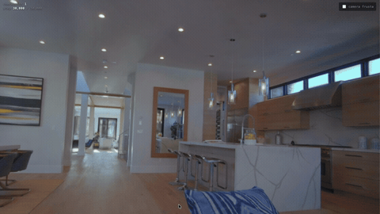

<h1 align="center">Splat Local</h1>

<p align="center"><b>Walk through a space once. Get a 3D scene you can fly through forever.</b></p>

<p align="center">
  
  
  
  
  
</p>

Turn a video walkthrough into a 3D Gaussian Splat and watch the scene resolve out of the fog, live, in your browser — no cloud, no CUDA, nothing leaves your Mac. Downloads as `.ply` (plus `.spz` / `.sog` when available).

<table>
<tr>
<th align="center">🎥 record a walkthrough</th>
<th align="center">✨ get an explorable 3D scene</th>
</tr>
<tr>
<td></td>
<td></td>
</tr>
</table>

<sub>An 11 s phone-style walkthrough → a splat you can fly through with WASD/arrow keys. Reconstructed end-to-end in ~25 min on an M5 Pro MacBook — 165 frames, COLMAP poses, 30k training steps. Footage: [Pexels #7578547](https://www.pexels.com/video/video-of-a-house-interior-7578547/) (free license).</sub>

## Why

- **Actually local.** Poses, training, and the viewer all run on your machine — nothing uploaded, no API keys, no CUDA required.
- **You watch it build.** Training checkpoints stream straight into the browser viewer, so the scene sharpens from fog into a real space in real time instead of a progress bar.
- **Quality that holds up.** COLMAP-grade poses + a Metal-native trainer that matches CUDA gsplat output, not a lightweight approximation.

## How it works

```
video ──▶ sharp frames ──▶ camera poses ──▶ splat training ──▶ cleanup/export
          (ffmpeg +        (COLMAP, or       (Brush: Metal-      (splat-transform:
           sharp-frames)    Depth Anything 3  native 3DGS w/      floater removal,
                            on MPS)           MCMC + mip AA)      .ply/.spz/.sog)
```

- **Poses**: [COLMAP](https://colmap.github.io) (`pycolmap`) with sequential matching + loop detection — best quality. Optional experimental backend: [Depth Anything 3](https://github.com/ByteDance-Seed/Depth-Anything-3) running on Apple's MPS — much faster, slightly lower fidelity.
- **Training**: [Brush](https://github.com/ArthurBrussee/brush) — a Rust/Metal Gaussian-splat trainer that matches CUDA gsplat quality (MCMC densification, Mip-Splatting antialiasing, optional LPIPS loss). It exports `.ply` checkpoints throughout training, which the UI streams into a live [Spark](https://sparkjs.dev) viewer.
- **Everything runs on your Mac.** No cloud, no CUDA.

## Quickstart

```bash
./setup.sh        # installs ffmpeg/uv if missing, syncs Python env, fetches/builds Brush
./run.sh          # serves http://127.0.0.1:8000
```

Upload a video, pick a preset, watch it build. Presets:

| Preset  | Frames | Steps | Approx. time (M-series Pro) |
|---------|--------|-------|------------------------------|
| Preview | 100    | 10k   | ~20–30 min                   |
| High    | 200    | 30k   | ~2–3 h                       |
| Max     | 250    | 45k   | ~4 h                         |

## Capture tips (quality lives and dies here)

- Move **slowly** in an orbit/arc with lots of overlap; end near where you started (loop closure).
- Lock exposure/white balance if you can; 4K 60 fps gives the frame picker more sharp frames.
- Avoid moving subjects, whip pans, and textureless walls/sky-only shots.

## Notes

- Optional DA3 pose backend: `uv sync --group da3` (Python 3.12 venv, installs PyTorch). Uses `depth-anything/DA3-LARGE` by default; override with `DA3_MODEL=depth-anything/DA3-SMALL ./run.sh` for speed.
- Optional `.spz`/`.sog` export + floater cleanup uses `npx @playcanvas/splat-transform` (needs Node).
- Why not LingBot-World? It's an image→video *world generator* (28B params, CUDA-only, no 3D output) — the wrong tool for video→3D reconstruction, and it can't run on a Mac. This project uses the reconstruction stack that modern world-model papers themselves use for geometry.

## Layout

`server/` FastAPI + pipeline stages · `web/` vanilla-JS UI + Spark viewer · `vendor/` Brush binary + viewer libs · `jobs/` per-run work dirs (gitignored) · `docs/api.md` API contract
